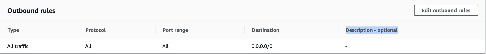
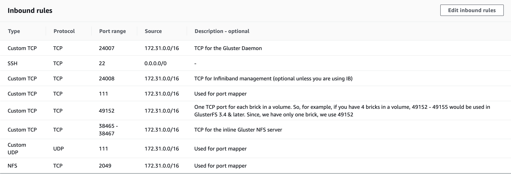

# glusterfs
The current project enables provisioning of Gluster FS [https://www.gluster.org/] cluster over a host of machines.
It offers an easily configurable mechanism for initializing and setting up the cluster.
In the following subsections we present the workflow for you to set it up.

## "ansible-semaphore" Setup Instructions:

Refer : [ansible-semaphore](/wiki/semaphore_instructions/)

## Pre-requisites: 
- Ensure that you have installed ansible version 2.9.x on your local machine. Please see [https://www.ansible.com/] for further details on installing ansible on your local machine.
Once ensible is installed, you can verify its version using the command `ansible --version` on you bash shell. you should receive an output such as this:
```
ansible 2.9.1
config file = /Users/antorweep/Documents/dev/mysome_glusterfs/ansible.cfg
configured module search path = ['/Users/antorweep/.ansible/plugins/modules', '/usr/share/ansible/plugins/modules']
ansible python module location = /usr/local/lib/python3.7/site-packages/ansible
executable location = /usr/local/bin/ansible
python version = 3.7.4 (default, Jul  9 2019, 18:13:23) [Clang 10.0.1 (clang-1001.0.46.4)]
```
- Furthermore, on your local machine you need to have some ansible plugins installed.
  - Navigate to the folder `mysome_glusterfs`
  - Execute the command `ansible-galaxy install -r requirements.yml`

- The remote machines donot need ansible installed. However, all remote hosts **must** have python version `2.7.x` or `above`

### Security Rules
Make sure the following outbound (**optional**) and inbound rules are established for all the host machines that are part of the cluster.



Note: **incase of inbound rules, ensure that the source is the subnet range specific to your deployment**




## Configuration
There are very few parameters to be configured currently. All configurations are made inside *group_vars/all.yml*. 
  - **Volume Name**
  - **Device Path: ** Can be a physical volume (e.g.: /dev/xvdf) or a loop device (e.g.: /dev/loop0). loop device is used when you are in devmode, which means that you are not using a seperate volume, but the same volume where your OS is located
    - `device_path` specifies the path to to FS to use
    - `devmode`: Set it to True when there isn't any seperate volume on which you want to setup glusterfs. If you have a seperate volume(e.g.: /dev/xvdf) other than where your OS is located, set this value to False

  - **DEV MODE**: Only set this if **devmode: True**. Sets aside xGB of space on the FS to be used for GlusterFS. If we are using a sperate volume for GlusterFS, it will take the whole volume. Therefore, it is not required to be set when *devmode: False* 
    - `gfs_size`: Size of the initial volume on the report host that you want to add to gluster fs

## Defining the remote host machines
In order to set up gusterfs cluster we would need a set of host machines. Ansible will comunicate with these machines and setup your cluster.

### Setting up remote host machines [optional]
Currently the automation of VM generation is configured for only Digital Ocean. You can use github project digital_ocean_automation [https://github.com/achak1987/digital_ocean_automation] for spinning up a set of host machines. However, if you already have a set of host machines either spinned up using the above project or any other method, configure the connections with these host machines as described bellow. 
 
### Configuring connection to remote machine
- Please navigate to the file `inventory/hosts`
- In order the specify the host machines, you need to populate this file `inventory/hosts` with the ip address of these machines. Each line/row in the file would represent a host machine. The root/first line `[gfscluster]` gives a name to the cluster for internal reference in the project and **must not be changed**. Please fill each line thereafter in the format: 

`hostname ansible_host=remote.machine1.ip.adress ansible_python_interpreter="/path/to/python"`
  - `hostname`: can be any name. Must be unique for each machine. The project will internally refer to the machines with this name
  - `ansible_host`: the ip address of the remote host. This machine should be accessable over the network with this ip address
  - `ansible_python_interpreter`: In order for ansible to work, we need python 2.7.x or above available on each remote machine. Here we specify the **path of python on the remote machine** so that our local ansible project know where to find python on these machines.
- The following *example* defines 3 machines as remote hosts
```
[gfscluster]
gfs1 ansible_host=147.182.121.59  ansible_python_interpreter="/usr/bin/python3"
gfs2 ansible_host=117.247.73.159  ansible_python_interpreter="/usr/bin/python3"
gfs2 ansible_host=157.245.79.195  ansible_python_interpreter="/usr/bin/python3"
```
- **!!!Required: Ensure that you have password less SSH for these host for the user root**

## Setting up glusterfs
Setting up of glusterfs requires the following steps. Creating th infrastructure with all dependencies installed and starting the gluster services in all the host machines. Finally, there is also mounting the point, but it is required only at client system that uses this gluster cluster. Therefore the mounting is not conducted for this cluster and the playbook is just shown as an example on how to mount this cluster into another system.

- Playbook: `000.purge.yml`
  - Execute: `ansible-playbook -v 000.purge.yml -u root`
  - Purges all existing glusterfs setup for a fresh install
- Playbook: `001.requirements.yml`
  - Execute: `ansible-playbook -v 001.requirements.yml -u root`
  - Installs required ansible galaxy packages in the machine(localhost) which runs the ansible playbooks
- Playbook: `002.setup_glusterfs_infra.yml`
  - Execute: `ansible-playbook -v 002.setup_glusterfs_infra.yml -u root`
  - Sets up the remote host machines to join a glusterfs cluster
- Playbook: `003.setup_glusterfs_cluster.yml`
  - Execute: `ansible-playbook -v 003.setup_glusterfs_cluster.yml -u root`
  - Create the glusterfs cluster
- Playbook: `004.mount_glusterfs.yml`
    - Execute: `ansible-playbook -v 004.mount_glusterfs.yml -u root`
    - Mounts the glusterfs cluster. **Not to be executed for setting up this cluster**. It is rather shown as an example so that this cluster can be mounted into another system or cluster as a network file system
